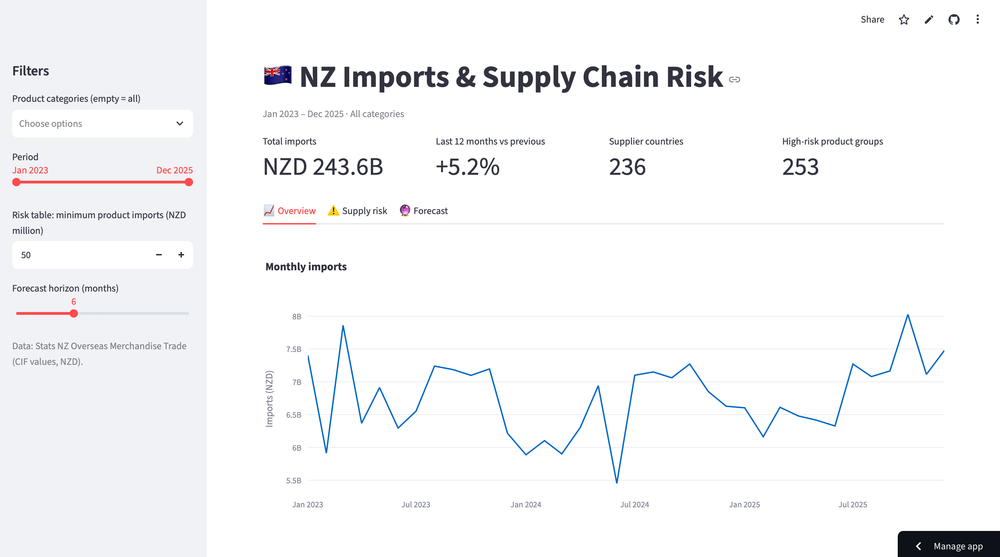

# 🇳🇿 NZ Imports & Supply Chain Risk Dashboard

**Live app:** [YOUR LINK]

An interactive dashboard that analyses New Zealand's imports (2023–2025, NZD 243.6B)
and identifies **products where NZ depends heavily on a single supplier country**.

## Why
Supply chains are exposed when one country supplies most of a product.
This project measures that exposure for every product group NZ imports,
so a supply chain team can see where a disruption would hurt most.

## Key findings
1. **Aluminium oxide – 98% from Australia (NZD 1.35B).** The main input for
   aluminium production depends almost entirely on one country.
2. **Cereals – 100% from Australia (NZD 988M).**
3. **Vegetable oils – 92% from Malaysia (NZD 173M).**
4. [Big red dot #1 from the scatter chart: product, share, value]
5. China supplies 21.5% of all NZ imports – twice the next country.

> Note: concentration measures *exposure*, not likelihood of disruption.
> Australia is a close, stable partner; the value is in knowing where to look.

## How it works
| Step | File | What it does |
|---|---|---|
| Clean | `src/clean.py` | Merges 3 years of Stats NZ data (1.35M rows), fixes formats across years, maps HS codes to 21 categories |
| Analyse | `src/metrics.py` | Totals, year-over-year growth, **supplier concentration (HHI)**, Holt-Winters forecast |
| Visualise | `app.py` | Streamlit dashboard with filters, risk table, drill-down and forecast |

**Risk score:** HHI = sum of squared supplier shares (0 = diversified, 1 = single supplier).
High risk = HHI > 0.25 or one country > 60%.

## Tech stack
Python · pandas · Plotly · Streamlit · statsmodels · Git

## Run locally
    python -m venv venv && source venv/bin/activate
    pip install -r requirements.txt
    streamlit run app.py

## Data
[Stats NZ – Overseas Merchandise Trade](https://www.stats.govt.nz/large-datasets/csv-files-for-download/overseas-merchandise-trade-datasets/),
CIF values in NZD, CC BY 4.0.

*Built by Omar [Last name] – Informatics student, Telkom University.*